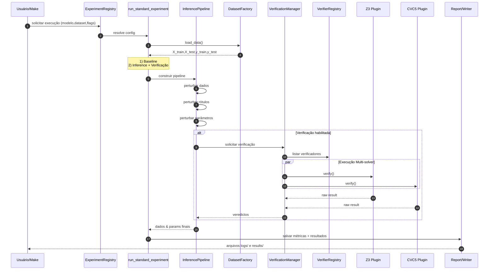
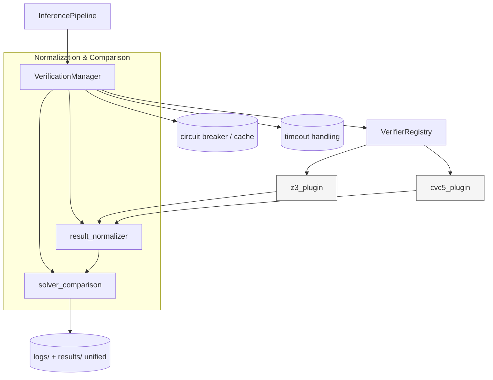
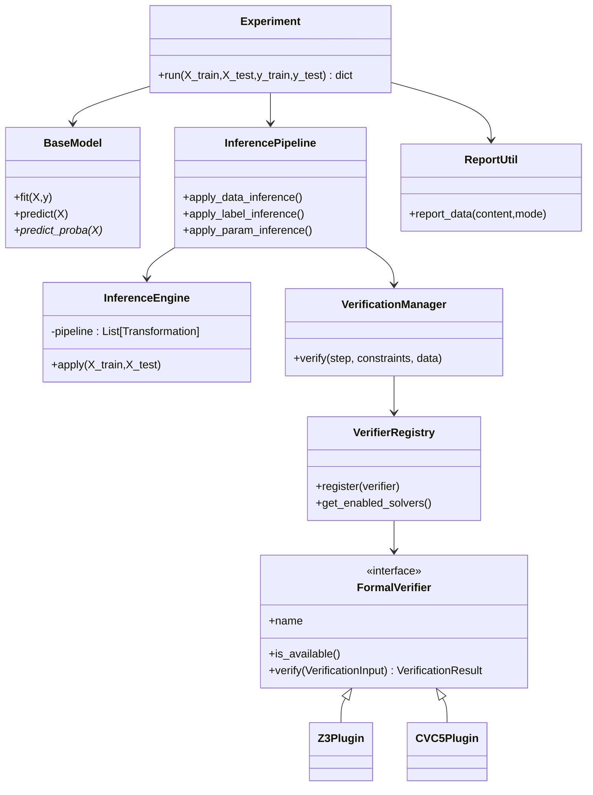
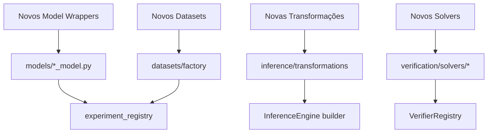
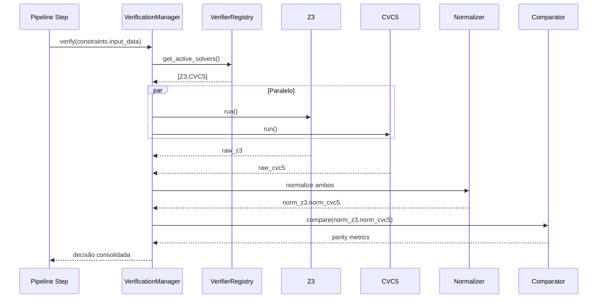

# Arquitetura do Sistema de Verificação no SIP

Este documento consolida os diagramas de arquitetura solicitados.

## Figura 1 — System Modules

```mermaid
graph TD
    A[CLI / Makefile] --> B[experiments/experiment_registry.py]
    B --> C[experiments/common.py<br/>run_standard_experiment]
    C --> D[datasets/<br/>factory + loaders]
    C --> E[models/<br/>wrappers sklearn]
    C --> F[inference/pipeline]
    F --> G[inference/engine(s)]
    G --> H[inference/transformations/*]
    F --> I[verification/core<br/>verification_manager]
    I --> J[verification/core/plugin_interface]
    J --> K[verification/solvers/z3_plugin]
    J --> L[verification/solvers/cvc5_plugin]
    I --> M[utils/solver_comparison.py]
    C --> N[utils/report.py<br/>report_data()]
    N --> O[(logs/)]
    N --> P[(results/)]
    subgraph Output
      O
      P
    end
    subgraph Verification
      I
      J
      K
      L
      M
    end
    subgraph Inference
      F
      G
      H
    end
    subgraph Data
      D
    end
    subgraph Models
      E
    end
```

## Figura 2 — Verification-augmented Experiment Flow



## Figura 3 — Multi-solver Verification Architecture



---

# Apêndice

## A. Pipeline Detail

```mermaid
flowchart LR
    subgraph Input
      A[X_train,X_test,y_train,y_test]
    end

    A --> B[DataNoiseConfig]
    B --> C[InferenceEngine (build pipeline)]
    C --> D[Transformações\nGaussian / Selective / Scale / Shuffle / Outliers / NaN / Remove / Swap / ClusterSwap / Drift]
    D --> E[X' (dados perturbados)]

    A --> F[LabelNoiseConfig]
    F --> G[LabelInferenceEngine]
    G --> H[Label Perturbações\nflip / confusion / partial / swap]
    H --> I[y' (labels perturbados)]

    A --> J[Param Config]
    J --> K[ParameterInferenceEngine]
    K --> L[Hyperparam Perturbações\ninteger / semantic / enum shift / scale]

    E --> M[Verificação pré/pós]
    H --> M
    L --> M
    M --> N[Veredictos]
    N --> O[Modelo + Métricas]
```

## B. Class Diagram Simplificado



## C. Extension Points



## D. Multi-Solver Sequence (Detalhado)



---
**Notas:**
- Todos os diagramas em Mermaid; podem ser renderizados em VS Code, GitHub ou MkDocs.
- Substitua legendas conforme estilo do artigo.
